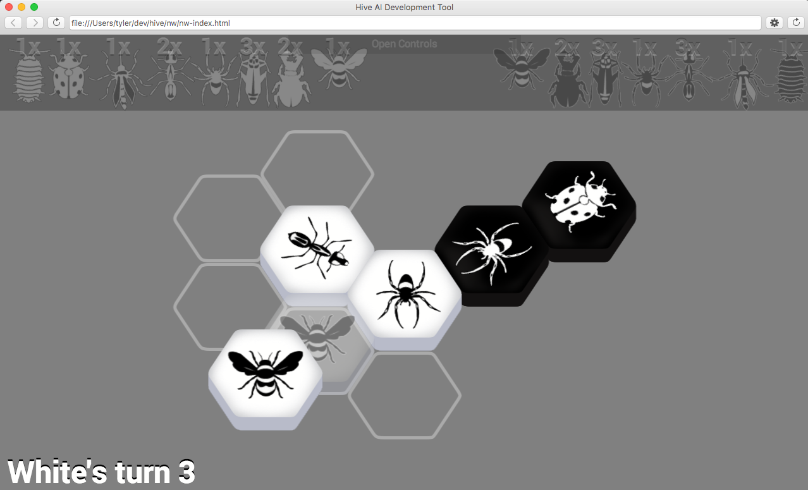
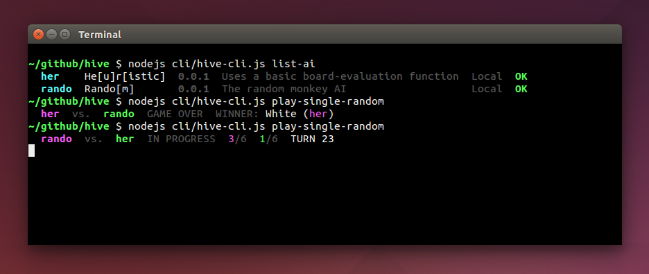

#Hive AI Development Tool

* [Implementing AI in Javascript](doc/hive-ai-js.md)
* [Implementing AI in Other Languages](doc/hive-ai-tcp.md)
* [Hive CLI Guide](doc/hive-cli.md)
* [Hive Node-Webkit UI Guide](doc/hive-node-webkit.md)
* [Hive Rules Core Implementation Details](doc/hive-core.md)

####Legal

This work is licensed under the [Research License 1.0](LICENSE.md) strictly for academic research and/or educational purposes *only*.

####Credits

Copyrighted Hive images are used with permission; please visit http://gen42.com/hive to purchase the board game upon which this tool is based, and support the author John Yianni.

